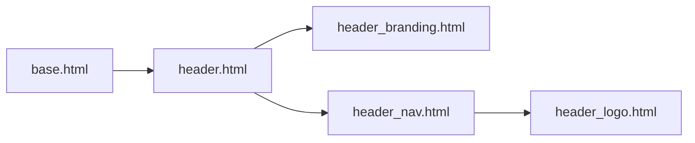

# GH-999: Editable header (`header-content`)

Plan for [#999 Let CMS Admin Edit Header](https://github.com/TACC/Core-CMS/issues/999) and stacked work on [`feat/GH-999-let-cms-admin-edit-header`](https://github.com/TACC/Core-CMS/pull/1083).

## Goals

| Priority | Item | This stack |
| --- | --- | --- |
| 1 | CMS-editable logo | [#1083](https://github.com/TACC/Core-CMS/pull/1083) (current) |
| 2 | Nav collapse breakpoint | Follow-up issue (not this stack) |
| 3 | Custom branding | PR 3 (TACC Header Branding plugin) |
| 4–6 | Portal nav, search, branding order | Later thin plugins / options |

**Backwards compatibility:** If `header-content` has no recognized plugins, render the header exactly as today (settings-driven branding + logo + nav).

**Precedence:** CMS plugin wins when present; otherwise settings (`LOGO` / `PORTAL_LOGO`, `BRANDING` / `PORTAL_BRANDING`).

## PR stack

1. **#1083 → `main`:** Logo via Picture (“Header logo” template), superuser-only static placeholder edit.
2. **PR 2** (base: feature branch): Orchestrator — `header-content` drives the whole `<header>`, not only the logo slot.
3. **PR 3** (base: after PR 2): TACC Header Branding plugin (nested Pictures only).

After #1083 merges, rebase the feature branch (or PR 2) onto `main` before the stack lands on `main`.

## Template files (what exists vs PR 2)

Portal/Guide repos duplicate header markup ([Confluence](https://confluence.tacc.utexas.edu/x/LoCnCQ)). **`base.html` should keep including `header.html` only** — do not rename or add a second public entry template.

| File | Status | Role |
| --- | --- | --- |
| [`header.html`](../taccsite_cms/templates/header.html) | **Keep** | Single entry point from `base.html`. Today (#1083): branding + nav; logo slot uses `static_placeholder` + fallback. **PR 2:** add orchestrator logic here (or via `` then the same includes). |
| [`header_branding.html`](../taccsite_cms/templates/header_branding.html) | **Keep** | Settings-driven sponsor strip (`#header-branding`). PR 3 adds plugin output that replaces this when a branding plugin is present. |
| [`header_logo.html`](../taccsite_cms/templates/header_logo.html) | **Keep** | Logo markup (settings `LOGO` / `PORTAL_LOGO` or `plugin_logo` from Picture). |
| `header_nav.html` | **New in PR 2 only** | Partial: the `<nav id="s-header">…</nav>` block (breakpoint classes, toggler, logo slot, CMS/portal/search menus). Accepts optional `plugin_logo` so orchestrator can inject a CMS logo without duplicating nav markup. |

**Not planned:** `header_default.html`, `header_content.html` as separate top-level templates. “Default header” means: `` + `` with no CMS logo override — the same composition as today, just with nav extracted for reuse when the orchestrator supplies a custom logo.

## Architecture (after PR 2 + PR 3)

`header-content` static placeholder = edit surface for the whole header. An orchestrator reads top-level plugins and maps them to slots; nav always renders via `header_nav.html`.

- Empty placeholder → branding from settings + logo from settings + nav.
- Top-level Picture with template `header_logo` → custom logo + settings branding (until PR 3) + nav.
- Top-level TACC Header Branding (PR 3) → plugin branding + logo rules above + nav.

Unrecognized top-level plugins are ignored until a dedicated wrapper exists.

## Testing

### #1083 (current branch — logo in nav slot only)

1. **Backwards compatibility:** Empty `header-content` → settings logo and unchanged branding/nav.
2. **Superuser — logo:** Add one Picture, template “Header logo”, image + link → custom logo in nav; branding/nav unchanged.
3. **Superuser — footer:** `footer-content` still editable and renders as before.
4. **Non-superuser:** Cannot edit static placeholders; header still settings-driven.
5. **Logo slot:** Placeholder wraps only the logo region inside `<nav>`. Only a Picture with “Header logo” template is supported for custom logo; do not rely on other plugin types in this PR.
6. **Permissions after deploy:** Run group-perms setup (`let_view_page_and_structure` / `set_group_perms`); re-check step 4.

### PR 2 (orchestrator)

1. Empty placeholder → pixel-equivalent to pre-PR-2 default (branding + settings logo + nav).
2. Custom logo Picture → logo from CMS; branding from settings; full nav present.
3. Superuser can still edit `header-content` (verify toolbar / static placeholder admin).
4. Non-superuser unchanged.

### PR 3 (branding plugin)

1. Branding plugin with nested Pictures → `#header-branding` from CMS; settings branding hidden when plugin present.
2. Branding plugin + header logo Picture → both slots filled; nav intact.
3. Plugin accepts Pictures only as children.
